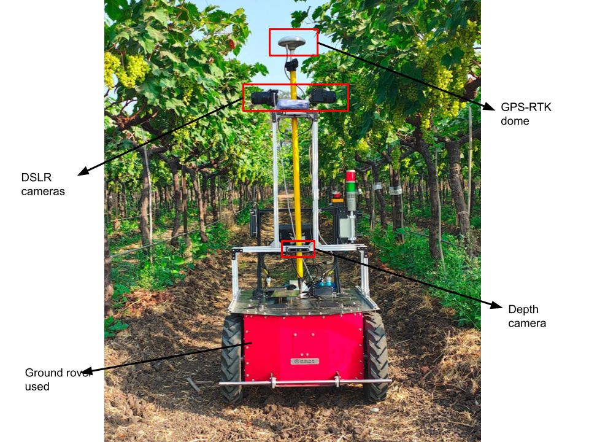
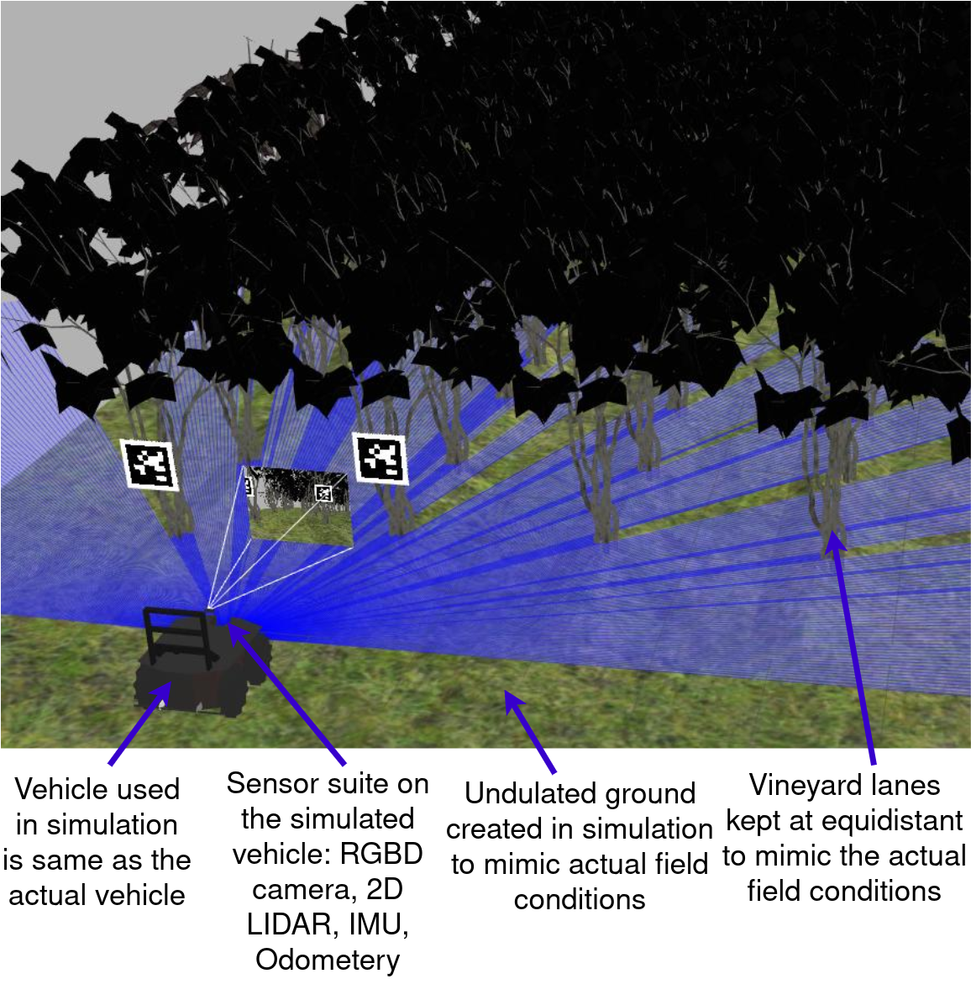
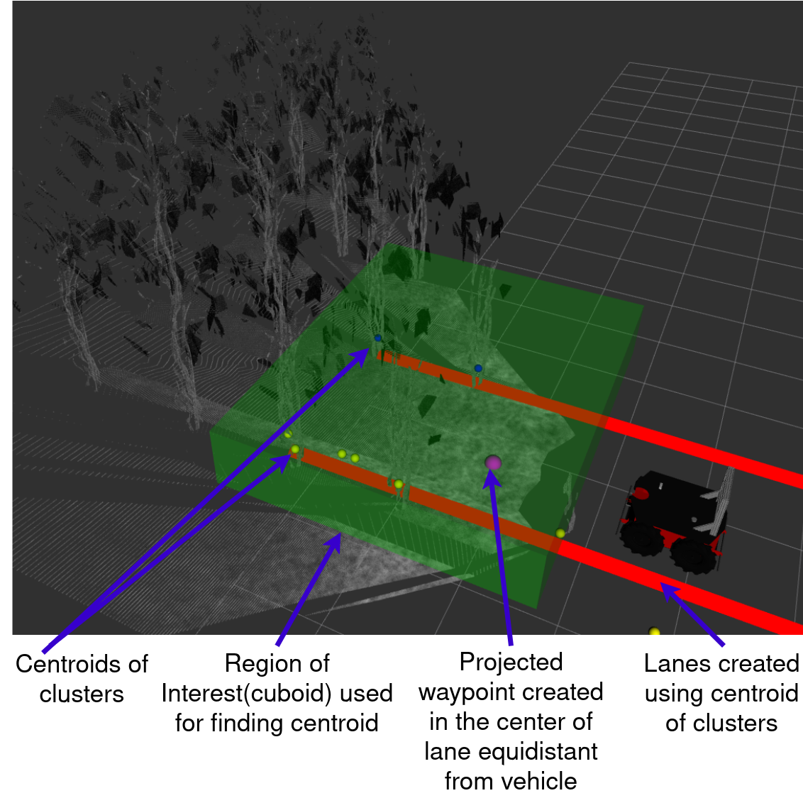

# Robotics-Based Data Collection for Precision Viticulture


This repository contains the complete ROS 1 Noetic implementation for the paper: **"Robotics-Based Spatio-Temporal Data Collection for Precision Viticulture: A Low-Cost, Hybrid Navigation Framework"**.

The project presents a resilient, dual-algorithm navigation framework for autonomous robots in challenging agricultural environments like vineyards. The system uses a vision-based local planner for precise in-row guidance and an RTK-GNSS-based global planner for robust waypoint navigation and row transitions.



## Key Features

### 1. High-Fidelity Gazebo Simulation
A custom Gazebo world was developed to accurately replicate the challenges of a real vineyard, allowing for rapid and safe algorithm development. The simulation includes a robot model with a full sensor suite and realistic, undulating terrain.



### 2. Vision-Based Lane Centering
The core of the in-row navigation is a lane-centering algorithm that processes 3D point cloud data from a stereo depth camera. It filters the data to a region of interest (ROI), uses DBSCAN to cluster lane boundaries, and projects a stable look-ahead waypoint for the controller to follow.



## Demonstration

The following video shows the lane centering algorithm in action within the Gazebo simulation. The robot successfully stays centered in the row by processing the point cloud and generating a smooth trajectory.

<!-- Option 1: Link to the AVI file -->
**[Watch the Lane Centering Demo Video](results/videos/Lane-centering-1.avi)**

<!-- Option 2 (Recommended): If you convert the AVI to a GIF named 'demo.gif' -->
<!--  -->

---

## Getting Started

### Prerequisites
- Ubuntu 20.04
- ROS 1 Noetic

### Dependencies
Install the required ROS packages for localization, Gazebo plugins, and sensor integration.
```bash
sudo apt-get update
sudo apt-get install ros-noetic-robot-localization ros-noetic-hector-gazebo-plugins ros-noetic-apriltag-ros
```

### Installation
1.  Clone this repository into your catkin workspace's `src` folder:
    ```bash
    cd ~/catkin_ws/src
    git clone [URL_TO_YOUR_REPOSITORY]
    ```
2.  Build the workspace:
    ```bash
    cd ~/catkin_ws
    catkin_make
    source devel/setup.bash
    ```

---

## Usage: Running the Simulation

Execute the following commands in separate terminals.

1.  **Launch the Gazebo World:**
    This command starts the Gazebo simulator with the custom vineyard world and spawns the DeltaXL robot model.
    ```bash
    roslaunch deltaxl_gazebo deltaXL_world.launch
    ```

2.  **Launch RViz for Visualization:**
    This command starts RViz with a pre-configured setup to visualize the robot's state, sensor data, and algorithm outputs.
    ```bash
    roslaunch deltaxl_viz view_robot.launch
    ```

3.  **Run the Lane Centering Algorithm:**
    This script processes the point cloud data and publishes waypoints for navigation.
    ```bash
    rosrun deltaxl_trajectory_control local_centre_lane.py
    ```

4.  **(Optional) Run Manual Teleop:**
    To manually drive the robot around the environment, you can use a teleop node.
    ```bash
    rosrun turtlebot3_teleop turtlebot3_teleop_key
    ```
---

## Configuration and Tuning

The parameters for the lane centering algorithm can be dynamically tuned in real-time using `rosparam`. This is useful for adapting the algorithm to different lighting conditions or canopy densities.

**Example:**
```bash
# Set a new height filter range for the point cloud
rosparam set /lane_detector/height_filter_min -0.4
rosparam set /lane_detector/height_filter_max -0.1

# Set new DBSCAN clustering parameters
rosparam set /lane_detector/dbscan_epsilon 0.1
rosparam set /lane_detector/dbscan_min_samples 20

# Adjust the point cloud downsample factor
rosparam set /lane_detector/downsample_factor 5
```

---

## URDF Configuration

The robot's sensor suite is defined in the `deltaXL.urdf.xacro` file. The following snippets show how the Realsense D435 camera and the MTK3339 GPS module were integrated.

**Realsense D435 Camera:**
```xml
<xacro:include filename="$(find deltaxl_description)/urdf/_d435.urdf.xacro" />
<xacro:sensor_d435 parent="base_link" >
  <origin xyz="0.2 0 0.65" rpy="0 0 0" />
</xacro:sensor_d435>
```

**MTK3339 GPS Sensor:**
```xml
<xacro:include filename="$(find deltaxl_description)/urdf/mtk3339.urdf.xacro" />  
<xacro:sensor_gps name="mtk3339" topic_ns="mtk_gps" parent="base_link" >
    <origin xyz="-0.2 0 0.45" rpy="0 0 0" />
</xacro:sensor_gps>
```

---

## Citation
If you use this work in your research, please cite our paper:
```bibtex
@inproceedings{patel2025robotics,
  title={Robotics-Based Spatio-Temporal Data Collection for Precision Viticulture: A Low-Cost, Hybrid Navigation Framework},
  author={},
  booktitle={IEEE Conference/Journal},
  year={2025}
}
```